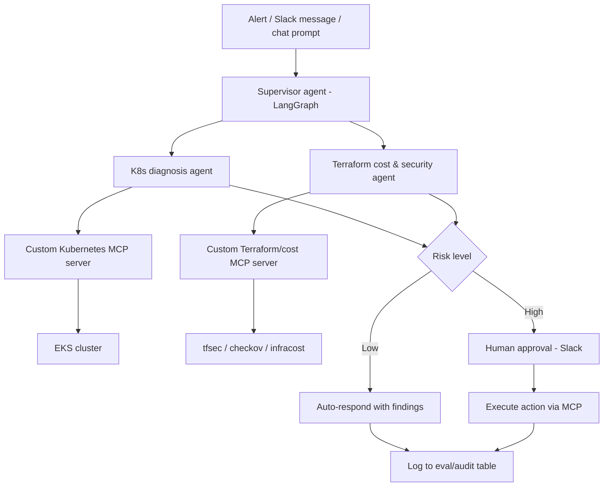
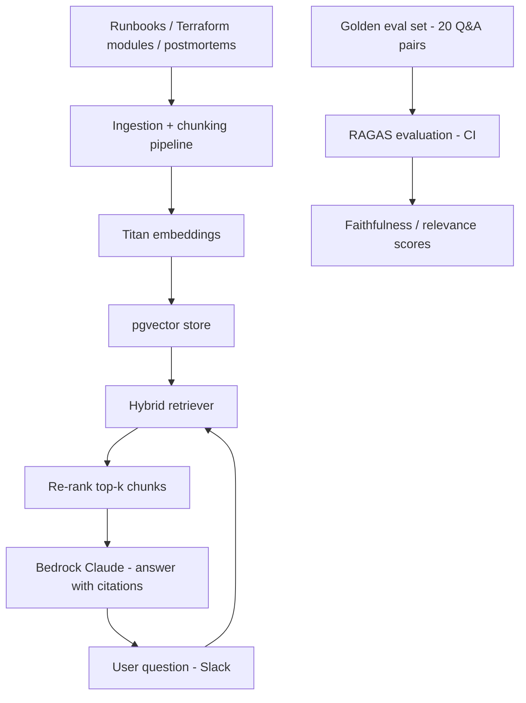
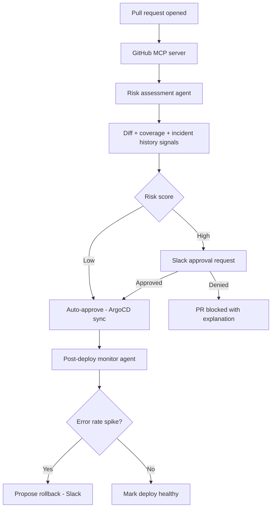
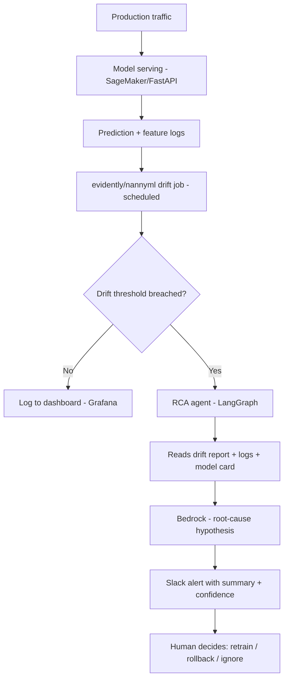
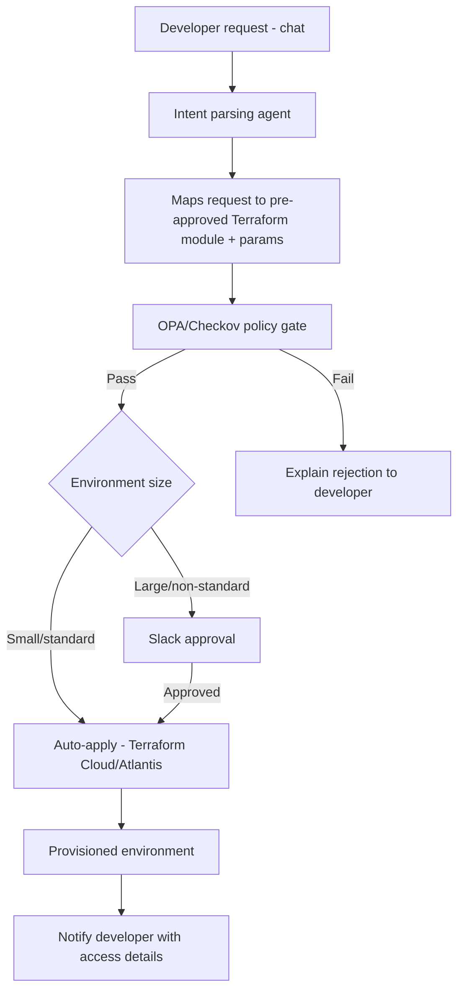

# 5 AI/DevOps Project Ideas for a ₹25–30 LPA Role

**Target roles:** AI DevOps Engineer, MLOps Engineer, AI Platform Engineer, Agentic AI Engineer, Cloud/DevOps Architect (mid-level, 3–6 yrs band)
**Your starting point:** AWS DevOps Engineer (EKS, Terraform, CI/CD, observability) transitioning into AI/Agentic AI
**Philosophy:** Each project below is scoped to be **finished and deployed by one person in 4–6 weeks**, not an enterprise platform. Recruiters at this salary band screen for *named skills done well and demoable*, not breadth of imagined features. Pick 1 as your flagship, 1 as a secondary — don't try to build all 5.

Each idea includes: why it matches real job descriptions, tech stack, an architecture diagram (renders automatically on GitHub), a week-by-week build plan, and interview talking points.

---

## Quick comparison

| # | Project | Best fits | Core skill proven | Build time |
|---|---------|-----------|-------------------|------------|
| 1 | Kubernetes & Cloud Cost Copilot | AI DevOps / SRE / Platform Engineer | Multi-agent + custom MCP server + IaC | 5–6 weeks |
| 2 | DevOps Knowledge RAG Assistant | Generative AI Engineer / AI Engineer | RAG architecture + evaluation | 4 weeks |
| 3 | Agentic CI/CD Release Risk Assessor | DevSecOps / Platform Engineer | Agentic CI/CD + governance | 4–5 weeks |
| 4 | MLOps Drift & Anomaly Copilot | MLOps Engineer | Classic MLOps + LLM-assisted RCA | 5 weeks |
| 5 | Self-Service Infra Agent (mini IDP) | Cloud Architect / Platform Engineer | Platform engineering + policy-as-code | 5–6 weeks |

**Recommendation:** Build **#1** as your flagship (it covers the most JD keywords: LangGraph, MCP, Bedrock, K8s, Terraform, eval). Build **#2** second — it's the fastest to finish and proves RAG depth that #1 doesn't fully cover.

---

## Project 1 — Kubernetes & Cloud Cost Copilot

**One-line pitch:** A small multi-agent system that diagnoses Kubernetes incidents and reviews Terraform PRs for cost/security risk, talking to your infra through an MCP server you wrote yourself.

### Why it fits
Maps directly to recurring JD language: *"build multi-agent systems using LangGraph,"* *"develop tool-calling via MCP,"* *"implement AI governance and risk controls,"* plus your own Terraform/EKS/Kubernetes background as the differentiator most pure-AI candidates lack.

### Tech stack
- **Orchestration:** LangGraph (supervisor + 2 specialist agents)
- **Model:** AWS Bedrock (Claude or Nova) via boto3
- **Tools:** Custom-built Kubernetes MCP server (Python, `mcp` SDK) + a Terraform/cost MCP server (wraps `tfsec`, `checkov`, `infracost`)
- **Infra:** EKS (or kind/minikube for the demo), Terraform for all provisioning
- **CI/CD:** GitHub Actions running the eval harness on every agent code change
- **Frontend:** Streamlit chat UI, deployed on a small EC2/Fargate box or Vercel (via a thin API)
- **Observability:** CloudWatch + a simple cost/run log table

### Architecture

### Build plan
- **Week 1:** Stand up EKS/kind cluster + Terraform repo with a few intentionally-flawed modules (open SG, oversized instance) to diagnose later.
- **Week 2:** Build the custom Kubernetes MCP server (list pods, get logs, describe, get events) and test it standalone with Claude Desktop or Cursor.
- **Week 3:** Build the Terraform/cost MCP server wrapping tfsec/checkov/infracost.
- **Week 4:** Build the LangGraph supervisor + 2 agents on Bedrock; wire in the approval gate.
- **Week 5:** Write 15–20 eval test cases (seeded failures) + GitHub Actions to run them; build the Streamlit demo.
- **Week 6:** Deploy demo, write README + architecture diagram + 3-minute demo video.

### Interview talking points
- Why you built your own MCP server instead of using an existing one.
- How the supervisor decides which agent to call (show the LangGraph state graph).
- What your eval harness catches and a real failure it caught.
- Why certain actions need human approval and how that's enforced in code, not just policy.

---

## Project 2 — DevOps Knowledge RAG Assistant

**One-line pitch:** A Slack/Teams bot that answers infra questions ("how do we roll back a bad deploy?", "what's our incident SOP for RDS failover?") by retrieving from your own runbooks, Terraform modules, and past incident postmortems.

### Why it fits
This is the fastest project to finish and most directly proves the **RAG architecture** skills that "Generative AI Engineer" and "AI Engineer" JDs ask for by name: chunking strategy, embeddings, vector DB, retrieval, and — critically — **evaluation**, which almost no portfolio RAG project includes.

### Tech stack
- **Ingestion:** Python scripts pulling Markdown runbooks, Terraform `.tf` files, and sample postmortems from a repo
- **Chunking:** LangChain text splitters (recursive + a Terraform-aware splitter that keeps resource blocks intact)
- **Embeddings:** Amazon Titan Embeddings (Bedrock) or `bge-small` if you want a non-AWS option
- **Vector DB:** pgvector on a small RDS/Postgres instance (cheap, and "I ran my own vector DB" is a stronger line than "I used Pinecone's free tier")
- **Retrieval:** Hybrid (vector + keyword/BM25) with metadata filtering (doc type, service name)
- **Generation:** Bedrock Claude with citations back to source chunks
- **Evaluation:** RAGAS (faithfulness, answer relevance, context precision) on a 20-question golden set
- **Interface:** Slack bot (Bolt SDK) or a simple web chat

### Architecture

### Build plan
- **Week 1:** Collect/write 30–50 real-ish runbooks, Terraform snippets, postmortems; build ingestion + chunking pipeline.
- **Week 2:** Embeddings + pgvector setup + hybrid retrieval; sanity-check retrieval quality manually.
- **Week 3:** Generation layer with citations; build the Slack bot interface.
- **Week 4:** Build the 20-question golden eval set, wire RAGAS into CI, write README and record a demo.

### Interview talking points
- Why you chose hybrid retrieval over pure vector search, with an example query where keyword search won.
- Your chunking strategy for structured content (Terraform) vs prose (runbooks).
- One RAGAS score that was low at first and what you changed to fix it.

---

## Project 3 — Agentic CI/CD Release Risk Assessor

**One-line pitch:** An agent that reviews every pull request and deployment, scores its risk (blast radius, test coverage, past incident correlation), and either auto-approves or routes to a human — closing the loop by watching post-deploy metrics and proposing rollback if something breaks.

### Why it fits
DevSecOps + Platform Engineering JDs ask for exactly this: governance embedded in the SDLC, human-in-the-loop for risky changes, and closed feedback loops. This project is the strongest "I understand production risk, not just AI" signal of the five.

### Tech stack
- **Source/CI:** GitHub Actions + GitHub MCP server (official) for PR/diff/history access
- **Orchestration:** LangGraph, single risk-assessment agent with a few tools
- **Signals used:** diff size/area, test coverage delta, historical incident correlation (simple keyword match against past postmortems), deploy frequency of the touched service
- **Deployment:** ArgoCD (GitOps) — agent posts a risk score as a PR comment and gates auto-sync
- **Post-deploy monitoring:** lightweight Prometheus check + an agent that watches error-rate for 15 minutes post-deploy and proposes (not executes) a rollback via Slack MCP
- **Human approval:** Slack MCP server, approve/deny buttons

### Architecture

### Build plan
- **Week 1:** Set up a demo repo + ArgoCD + a few services with seeded historical "incidents" (markdown postmortems) to correlate against.
- **Week 2:** Build the GitHub MCP integration + risk-scoring agent logic.
- **Week 3:** Wire the Slack approval flow and ArgoCD auto-sync gate.
- **Week 4:** Build the post-deploy monitoring agent + rollback proposal flow.
- **Week 5:** Eval set of 10–15 historical-style PRs with known "should have been blocked" labels; tune; write up.

### Interview talking points
- What signals actually predict risk in your scoring function, and which one mattered least.
- Why rollback is *proposed*, not *executed*, by the agent — your reasoning on autonomy boundaries.
- A risk score the agent got wrong and what you'd add to fix it.

---

## Project 4 — MLOps Drift & Anomaly Copilot

**One-line pitch:** A monitoring layer for a deployed ML model (can be a toy model) that detects data/prediction drift statistically, then uses an LLM agent to read the drift report plus recent logs and write a plain-English root-cause hypothesis and recommended action.

### Why it fits
This is the project that proves classic **MLOps** chops — model monitoring, drift detection, SLOs — which is the single most-requested skill set in AI DevOps JDs, *plus* a GenAI layer on top, which most traditional MLOps candidates don't have. It's the best project if you want to keep one foot firmly in "MLOps Engineer" job titles (which have a clearer, more established 25-30 LPA band than the newer "Agentic AI Engineer" title).

### Tech stack
- **Model serving:** A simple model (e.g. churn/fraud classifier) on SageMaker endpoint or a FastAPI container on EKS
- **Pipeline:** MLflow for experiment tracking and model registry
- **Drift detection:** `evidently` or `nannyml` for statistical drift (data + prediction) on a schedule
- **Observability:** Prometheus + Grafana for serving metrics (latency, throughput, error rate)
- **AI layer:** A LangGraph agent that, when drift crosses a threshold, pulls the drift report + recent logs + the model card and produces a root-cause hypothesis via Bedrock
- **Alerting:** Slack notification with the agent's summary and a confidence flag

### Architecture

### Build plan
- **Week 1:** Train/register a simple model in MLflow; deploy it behind an API; generate synthetic traffic with deliberate drift injected partway through.
- **Week 2:** Set up evidently/nannyml scheduled drift jobs + Grafana dashboards.
- **Week 3:** Build the RCA agent and wire it to fire only above a drift threshold.
- **Week 4:** Tune prompt/agent against a few labeled drift scenarios; add confidence scoring.
- **Week 5:** Write up, record demo showing drift injected live and the agent catching it.

### Interview talking points
- The difference between data drift and prediction drift, and which your project detects.
- Why the agent only triggers above a threshold instead of running on every request (cost/noise tradeoff).
- One case where the agent's hypothesis was wrong, and how you'd validate its hypotheses going forward.

---

## Project 5 — Self-Service Infra Agent (mini Internal Developer Platform)

**One-line ptich:** A chat-driven self-service layer where a developer types "give me a staging Postgres + Redis environment for the payments service" and an agent generates the Terraform, runs it through policy checks (OPA/Checkov), and provisions it after approval — the "golden path" pattern from internal developer platforms, with an agent as the front door instead of a portal form.

### Why it fits
This is the project for **Platform Engineer / Cloud Architect** JDs specifically — it demonstrates governance, self-service provisioning, and golden paths, which are the exact phrases used in platform engineering job postings, with an agentic interface as the differentiator over a typical Backstage-only setup.

### Tech stack
- **Interface:** Slack bot or simple web chat (natural-language request)
- **Agent:** LangGraph agent that converts intent → parameters → a Terraform module call (not free-form generation — it fills in a pre-approved module, which is safer and a better interview answer than "the agent writes arbitrary Terraform")
- **Policy:** OPA/Conftest + Checkov gate before any apply
- **Provisioning:** Terraform Cloud or Atlantis for the actual apply, triggered after approval
- **Approval:** Slack approve/deny for anything outside pre-approved small environments
- **Catalog (optional, if time allows):** Backstage as the visual layer on top, agent as the API behind a Backstage template

### Architecture

### Build plan
- **Week 1:** Build 2–3 pre-approved Terraform modules (e.g. "staging service stack", "ephemeral test DB") with parameters.
- **Week 2:** Build the intent-parsing agent that maps natural language to module + params (constrained output, not free generation).
- **Week 3:** Wire OPA/Checkov policy gate + Atlantis/Terraform Cloud trigger.
- **Week 4:** Build the Slack approval flow for non-standard requests.
- **Week 5–6:** Add Backstage as the visual catalog (optional), write up, record demo.

### Interview talking points
- Why the agent fills in pre-approved modules instead of generating arbitrary Terraform (safety/blast-radius reasoning).
- What your policy gate actually blocks, with a concrete rejected example.
- How this maps to the "golden path" concept in platform engineering.

---

## How to use this doc

1. Pick **one** flagship project (recommended: #1) and **one** secondary (recommended: #2 or #4 depending on whether you want to lean more "Agentic AI" or more "MLOps").
2. Don't start building until you've written the README's architecture section *first* — it forces you to actually decide the design before writing code, and you'll reuse that text for the real repo.
3. Treat the eval harness as non-optional, not a stretch goal — it's the single most differentiating artifact across all five projects.
4. Ship something deployable and clickable before polishing anything else. A rough but live demo beats a polished but local-only one in every interview.
